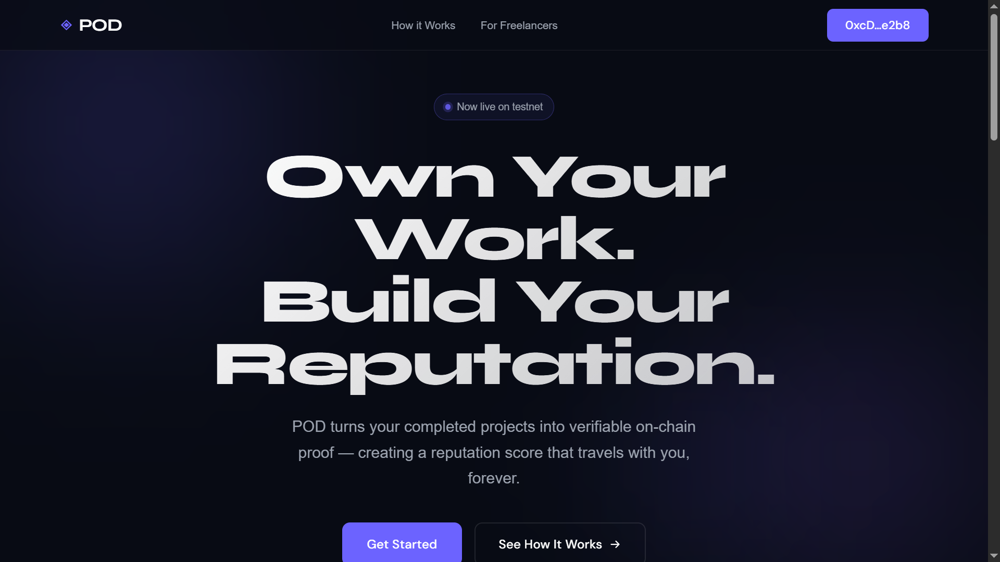

<p align="center">
  
</p>

<h1 align="center">POD — Part of Dreams</h1>

<p align="center">
  <strong>Own Your Work. Build Your Reputation. On-Chain.</strong>
</p>

<p align="center">
  <a href="https://pod-topaz.vercel.app">Live Demo</a> &nbsp;|&nbsp;
  <a href="#how-it-works">How It Works</a> &nbsp;|&nbsp;
  <a href="#0g-integrations">0G Integrations</a> &nbsp;|&nbsp;
  <a href="#getting-started">Get Started</a>
</p>

<p align="center">
  
  
  
  
</p>

---

## The Problem

Freelancers have no portable reputation. Every time you switch platforms — Upwork, Fiverr, Freelancer — you start from zero. Years of 5-star reviews, successful deliveries, and happy clients are locked inside walled gardens that don't talk to each other.

Your reputation should belong to **you**, not a platform.

## The Solution

**POD (Part of Dreams)** turns completed freelance work into **verifiable on-chain proof** stored on the 0G Network. An AI-powered reputation engine scores your track record, and your score is minted as an **Agent ID** — a portable, tamper-proof identity that travels with your wallet.

No middleman. No platform lock-in. Your work history lives on-chain, forever.

---

## How It Works

```
┌─────────────┐     ┌──────────────┐     ┌─────────────┐     ┌──────────────┐
│  Submit Work │────>│  0G Storage  │────>│  0G Compute  │────>│  Agent ID    │
│  Proof       │     │  (On-Chain)  │     │  (AI Score)  │     │  (Mint NFT)  │
└─────────────┘     └──────────────┘     └─────────────┘     └──────────────┘
```

### 1. Submit Work Proof
Freelancers submit proof of completed work — project title, description, deliverable link, client wallet, payment amount, and completion date. All fields are structured into a canonical JSON payload.

### 2. Store on 0G Network
The proof is uploaded to the **0G Storage** network via the indexer HTTP API. If the indexer is unavailable, the proof is encoded as calldata in an on-chain transaction on the **0G Galileo Testnet** — ensuring the data is always persisted regardless of infrastructure availability.

### 3. AI Reputation Scoring
All verified proofs for a wallet are sent to **0G Compute** (decentralized AI inference via the 0G Serving Broker) running **Llama 3.1 8B**. The model analyzes the freelancer's work history and returns a **POD Score (0–1000)** with a detailed breakdown:

| Category | What It Measures |
|---|---|
| **Delivery Rate** | Volume and consistency of completed projects |
| **Client Satisfaction** | Completeness of records and positive signals |
| **On-Time Rate** | Earnings growth and payment reliability |
| **Work Diversity** | Variety of clients and project types |

A deterministic local scoring algorithm serves as a fallback when the AI inference endpoint is unavailable.

### 4. Mint Agent ID
Once scored, freelancers can mint their reputation as an **on-chain Agent ID** on the 0G Galileo Testnet. The Agent ID encodes the wallet address, POD Score, breakdown, and timestamp — creating a permanent, verifiable identity token.

---

## Screenshots

<p align="center">
  
  <br/><em>Landing — Clean, modern hero with live testnet badge</em>
</p>

<p align="center">
  
  <br/><em>Dashboard — Real-time POD Score ring, stats, and verified work history</em>
</p>

<p align="center">
  
  <br/><em>Submit Work — Structured proof form with on-chain storage confirmation</em>
</p>

<p align="center">
  
  <br/><em>Score — Full AI-powered breakdown with category insights and history chart</em>
</p>

<p align="center">
  
  <br/><em>Agent ID — Minted on-chain identity with transaction verification</em>
</p>

---

## 0G Integrations

POD is built natively on the **0G ecosystem**, leveraging three core primitives:

### 0G Storage — Immutable Work Proofs
- Proof JSON is uploaded via the 0G Storage indexer HTTP API (`/file/upload`)
- Fallback: proof is encoded as hex calldata and sent as an on-chain transaction to `0x...dEaD` on 0G Galileo
- Every proof gets a permanent transaction hash as its receipt
- **File:** [`src/services/ogStorage.js`](src/services/ogStorage.js)

### 0G Compute — AI Reputation Scoring
- Proofs are sent to the **0G Serving Broker** (`serving-broker-testnet.0g.ai`)
- Uses the OpenAI-compatible chat completions API with `meta-llama/Llama-3.1-8B-Instruct`
- The model evaluates work history and returns structured JSON: score, percentile, breakdown, and natural-language insight
- 5-minute score caching prevents redundant inference calls
- Deterministic local algorithm as graceful fallback
- **File:** [`src/services/ogCompute.js`](src/services/ogCompute.js)

### Agent ID — On-Chain Identity Minting
- POD Score + wallet + timestamp encoded as calldata and minted on **0G Galileo Testnet** (Chain ID: 16602)
- Generates a unique Agent ID (e.g., `POD-3A7F2B1C`) derived from the transaction hash
- Minted state persists across sessions
- Transaction verifiable on the [0G Explorer](https://chainscan-galileo.0g.ai)
- **File:** [`src/services/agentId.js`](src/services/agentId.js)

### Network Details

| Property | Value |
|---|---|
| Chain | 0G Galileo Testnet |
| Chain ID | 16602 |
| RPC | `https://evmrpc-testnet.0g.ai` |
| Explorer | `https://chainscan-galileo.0g.ai` |
| Native Token | OG |

---

## Tech Stack

| Layer | Technology |
|---|---|
| **Frontend** | React 19, React Router 7, Vite 8 |
| **Wallet** | RainbowKit 2, wagmi 2, viem |
| **Blockchain** | 0G Galileo Testnet (EVM) |
| **AI Inference** | 0G Compute / Serving Broker (Llama 3.1 8B) |
| **Storage** | 0G Storage Network + on-chain calldata fallback |
| **Styling** | Custom CSS with design tokens, conic-gradient score rings |
| **Deployment** | Vercel |

---

## Project Structure

```
src/
├── services/
│   ├── ogStorage.js      # 0G Storage — work proof uploads
│   ├── ogCompute.js       # 0G Compute — AI scoring + local fallback
│   └── agentId.js         # Agent ID — on-chain identity minting
├── pages/
│   ├── Landing.jsx        # Hero + how-it-works + features
│   ├── Dashboard.jsx      # Profile, score ring, stats, work history, Agent ID
│   ├── SubmitWork.jsx     # Work proof submission form
│   └── Score.jsx          # Full score breakdown + AI insights + chart
├── components/
│   ├── Navbar.jsx         # Responsive nav with wallet connection
│   └── WalletButton.jsx   # RainbowKit connect button wrapper
├── App.jsx                # Router + wrong-network banner
├── wagmi.js               # Chain config + wallet connectors
└── main.jsx               # Entry point with providers
```

---

## Getting Started

### Prerequisites

- Node.js 18+
- A browser wallet (Rabby, MetaMask, etc.)
- 0G Galileo testnet OG tokens ([faucet](https://faucet.0g.ai))

### Installation

```bash
# Clone the repository
git clone https://github.com/YourUsername/POD.git
cd POD

# Install dependencies
npm install

# Start the dev server
npm run dev
```

The app will be running at `http://localhost:5173`.

### Environment Variables (Optional)

Create a `.env` file to override defaults:

```env
# WalletConnect project ID (get one at https://cloud.walletconnect.com)
VITE_WALLETCONNECT_PROJECT_ID=your_project_id

# 0G Compute endpoint (defaults to serving broker testnet)
VITE_OG_COMPUTE_URL=https://serving-broker-testnet.0g.ai/v1/chat/completions

# 0G Compute model (defaults to Llama 3.1 8B)
VITE_OG_COMPUTE_MODEL=meta-llama/Llama-3.1-8B-Instruct
```

### Usage

1. **Connect wallet** — Click "Connect Wallet" and select your browser wallet
2. **Switch to 0G Galileo** — The app will prompt you to add/switch to the testnet
3. **Submit work proof** — Go to Submit Work, fill in your project details, and store on-chain
4. **View your score** — Dashboard shows your real-time POD Score computed by 0G Compute
5. **Mint Agent ID** — Once you have a score, click "Mint Agent ID" to create your on-chain identity

---

## Live Demo

**[pod-topaz.vercel.app](https://pod-topaz.vercel.app)**

---

## Architecture Diagram

```
                         ┌─────────────────────────────┐
                         │        POD Frontend          │
                         │   React + RainbowKit + wagmi │
                         └──────┬──────┬──────┬─────────┘
                                │      │      │
                    ┌───────────┘      │      └───────────┐
                    ▼                  ▼                   ▼
          ┌─────────────────┐ ┌───────────────┐ ┌─────────────────┐
          │   0G Storage    │ │  0G Compute   │ │  0G Galileo     │
          │                 │ │               │ │  Testnet        │
          │ Indexer HTTP API│ │ Serving Broker│ │                 │
          │ + On-chain      │ │ Llama 3.1 8B  │ │ Agent ID Mint   │
          │   calldata      │ │ AI Inference  │ │ Work Proof Tx   │
          └─────────────────┘ └───────────────┘ └─────────────────┘
                    │                  │                   │
                    └──────────────────┴───────────────────┘
                                       │
                              0G Galileo Testnet
                              Chain ID: 16602
```

---

## What's Next

- **ERC-721 Agent ID NFT** — Deploy a smart contract so Agent IDs are tradeable, composable NFTs
- **Cross-platform verification** — Import proofs from GitHub, Dribbble, and existing freelance platforms
- **Client-side attestations** — Allow clients to sign and attest to completed work on-chain
- **Score decay & refresh** — Time-weighted scoring that rewards recent, consistent delivery
- **0G Storage DA integration** — Use 0G's data availability layer for cheaper bulk proof storage
- **Multi-chain Agent ID** — Bridge minted identities to Ethereum, Base, and other L2s

---

## Team

Built for the **0G APAC Hackathon** by the POD team.

---

<p align="center">
  <strong>POD — Part of Dreams</strong><br/>
  Your work. Your proof. Your reputation. On-chain, forever.
</p>
